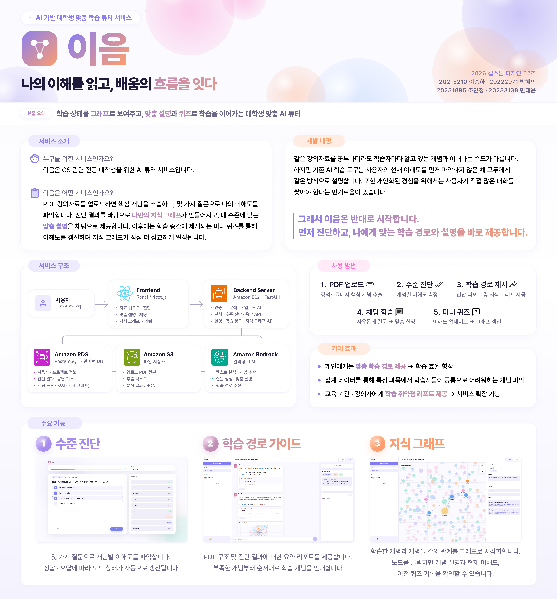
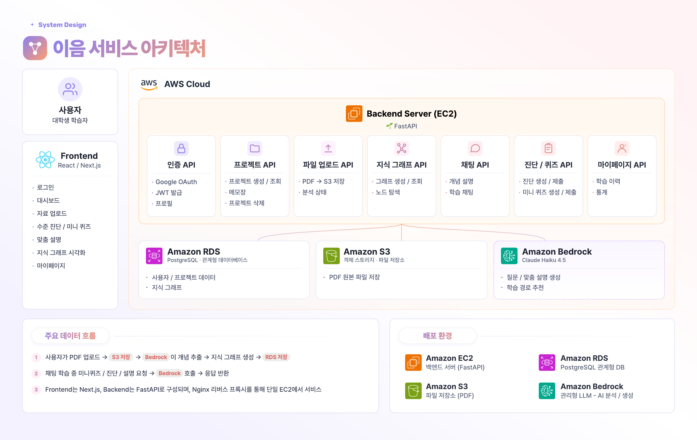

<p align="center">
  
</p>

<div align="center">
  <h1>이음 : 개념 이해를 추적하는 AI 학습 튜터</h1>
  <h3>나의 이해를 읽고, 배움의 흐름을 잇다</h3>
  <p>
    이음은 학습자료를 개념 그래프로 구조화하고,<br />
    수준진단 · 채팅 학습 · 미니퀴즈 · 리포트를 통해 개념별 이해 상태와 다음 학습 방향을 이어주는 AI 학습 튜터입니다.
  </p>
</div>

<p align="center">
  <a href="http://eeum-study.kr/"></a>
  <a href="https://kookmin-sw.github.io/2026-capstone-52/"></a>
</p>

<p align="center">
  
  
  
  
  
  
  
  
  
  
</p>

---

## 목차

:one: 📌 [프로젝트 소개](#one프로젝트-소개)<br />
:two: ✨ [주요 기능](#two주요-기능)<br />
:three: 🎬 [소개 영상](#three소개-영상)<br />
:four: 🏗️ [시스템 구조](#four시스템-구조)<br />
:five: 👥 [팀원 소개](#five팀원-소개)<br />
:six: 🛠️ [기술 스택](#six기술-스택)<br />
:seven: 📁 [폴더 구조](#seven폴더-구조)<br />
:eight: 🚀 [실행 방법](#eight실행-방법)<br />
:nine: 📚 [참고 자료](#nine참고-자료)

---

## :one:프로젝트 소개
<p align="center">
  
</p>

기존 LLM 기반 학습 서비스는 사용자의 현재 이해 수준을 충분히 반영하지 못하고,
단순 질의응답 중심으로 동작하는 경우가 많습니다.

EEUM은 사용자의 학습 자료와 수준 진단 결과를 기반으로,
개인의 이해 상태를 분석하고 맞춤형 학습 경험을 제공하는 것을 목표로 합니다.

### 핵심 차별점

- 단순 챗봇이 아닌 수준 진단 기반 개인화 학습
- 선수 개념 기반 진단 흐름
- PDF + Knowledge Graph + RAG 결합 구조
- 프로젝트 단위 학습 상태 추적
- 학습 로그 및 메모 기반 학습 관리
- N-term 간 집중 학습 개념에 대한 미니 퀴즈

---

## :two:주요 기능

### 1. PDF 업로드 및 분석

- CS 학습 자료 PDF 업로드
- PDF 본문 기반 핵심 개념 추출
- 개념 간 관계 분석 및 지식 그래프 생성
- 프로젝트별 PDF 분석 상태 관리

### 2. 수준진단

- 지식 그래프의 핵심 개념 기반 진단 문항 생성
- 사용자의 초기 이해도 측정
- 개념별 이해 상태 및 점수 반영
- 부족한 개념과 추천 학습 경로 제공

### 3. AI 질의응답

- 업로드한 PDF와 지식 그래프 기반 답변 생성
- 사용자의 진단 결과와 학습 상태를 반영한 설명 제공
- 채팅 중 등장한 개념을 추적하여 후속 학습 흐름과 연결

### 4. Knowledge Graph

- PDF에서 추출한 개념과 관계 시각화
- 개념별 학습 상태 변화 표시
- 프로젝트별 지식 그래프 관리
- 노드별 설명, 관련 개념, 퀴즈 이력 확인

### 5. 미니퀴즈

- 최근 AI 답변에서 반복적으로 등장한 개념 기반 미니퀴즈 제안
- 퀴즈 결과를 개념별 이해 상태에 반영
- 사용자가 미룬 미니퀴즈 관리
- 회상 연습을 통한 학습 상태 업데이트

### 6. 학습 기록 관리

- 프로젝트별 채팅방 및 채팅 기록 저장
- 수준진단 결과와 미니퀴즈 풀이 기록 관리
- 프로젝트별 메모장 기능 제공
- 사용자별 프로젝트 및 학습 데이터 분리 관리


---
## :three:소개 영상
>시연 영상 추가예정
---

## :four:시스템 구조



---
## :five:팀원 소개

<table>
  <tr>
    <th width="300" align="center">이송하</th>
    <th width="300" align="center">박혜민</th>
  </tr>
  <tr>
    <td align="center"></td>
    <td align="center"></td>
  </tr>
  <tr>
    <td align="center">20215210</td>
    <td align="center">20222971</td>
  </tr>
  <tr>
    <td align="center">songha327@kookmin.ac.kr</td>
    <td align="center">hyeals22@gmail.com</td>
  </tr>
  <tr>
    <td align="center">Frontend</td>
    <td align="center">Backend</td>
  </tr>
  <tr>
    <td align="center"><a href="https://github.com/hassong327">@hassong327</a></td>
    <td align="center"><a href="https://github.com/hyeals2">@hyeals2</a></td>
  </tr>
  <tr>
    <th width="300" align="center">조민정</th>
    <th width="300" align="center">민태윤</th>
  </tr>
  <tr>
    <td align="center"></td>
    <td align="center"></td>
  </tr>
  <tr>
    <td align="center">20231895</td>
    <td align="center">20233138</td>
  </tr>
  <tr>
    <td align="center">chominjung821@kookmin.ac.kr</td>
    <td align="center">mintaeyoon@kookmin.ac.kr</td>
  </tr>
  <tr>
    <td align="center">Backend</td>
    <td align="center">AI</td>
  </tr>
  <tr>
    <td align="center"><a href="https://github.com/itsminjeong">@itsminjeong</a></td>
    <td align="center"><a href="https://github.com/Min-Taeyoon">@Min-Taeyoon</a></td>
  </tr>
</table>

---

## :six:기술 스택

**Frontend**

<p>
  
  
  
  
  
  
  
</p>

**Backend**

<p>
  
  
  
  
  
  
  
</p>

**AI / ML**

<p>
  
  
  
</p>

**Infra (AWS · EC2)**

<p>
  
  
  
  
  
</p>

## :seven:폴더 구조

```text
  2026-capstone-52/
    ├── backend/                         # FastAPI 백엔드 및 AI 로직
    │   ├── app/
    │   │   ├── main.py                  # FastAPI 앱 진입점, 라우터 등록
    │   │   ├── core/                    # 환경변수, 보안, 공통 설정
    │   │   │   ├── config.py            # DB, AWS S3, Bedrock 모델 설정
    │   │   │   └── security.py          # 인증/보안 관련 유틸리티
    │   │   ├── db/                      # 데이터베이스 연결 설정
    │   │   │   ├── base.py              # SQLAlchemy Base 및 모델 import
    │   │   │   └── session.py           # DB 엔진 및 세션 관리
    │   │   ├── api/                     # API 라우터 계층
    │   │   │   └── routes/
    │   │   │       ├── users.py         # 사용자/Google 로그인 API
    │   │   │       ├── projects.py      # 프로젝트 API
    │   │   │       ├── project_memos.py # 프로젝트 메모 API
    │   │   │       ├── learning_logs.py # 학습 로그 API
    │   │   │       ├── mypage.py        # 마이페이지 API
    │   │   │       ├── upload.py        # PDF 업로드 및 분석 API
    │   │   │       ├── graph.py         # 지식 그래프 API
    │   │   │       ├── chat.py          # AI 채팅 API
    │   │   │       ├── diagnosis.py     # 진단 API
    │   │   │       ├── explanation.py   # 맞춤 설명 API
    │   │   │       └── mini_quiz.py     # 미니 퀴즈 API
    │   │   ├── models/                  # SQLAlchemy ORM 모델
    │   │   ├── schemas/                 # Pydantic 요청/응답 스키마
    │   │   ├── services/                # 비즈니스 로직 계층
    │   │   ├── ai/                      # AI 기능 모듈
    │   │   │   ├── llm_client.py        # Amazon Bedrock Claude 호출 공통 클라이언트
    │   │   │   ├── graph_extractor.py   # PDF 기반 개념/관계 추출
    │   │   │   ├── concept_normalizer.py# 개념 alias/fuzzy/LLM 정규화
    │   │   │   ├── chat_ai.py           # 학습 채팅 AI
    │   │   │   ├── diagnosis_ai.py      # 진단 문항 생성 및 채점
    │   │   │   ├── explanation_ai.py    # 개인화 설명 생성
    │   │   │   ├── title_ai.py          # 제목 생성 AI
    │   │   │   └── language.py          # 언어 처리 유틸리티
    │   │   ├── data/                    # AI 분석용 로컬 데이터
    │   │   │   ├── aliases/             # 과목별 개념 alias JSON
    │   │   │   └── backbone/            # 과목별 backbone chunk JSON
    │   │   └── utils/                   # 공통 유틸리티
    │   ├── migrations/                  # DB 마이그레이션 SQL
    │   ├── scripts/                     # 백엔드 개발/전처리 스크립트
    │   │   └── preprocess_backbone_pdf.py # PDF를 backbone chunk JSON으로 변환
    │   ├── .env.example                 # 백엔드 환경변수 예시
    │   └── requirements.txt             # 백엔드 Python 의존성
    │
    ├── frontend/                        # Next.js 프론트엔드 애플리케이션
    │   ├── app/                         # Next.js App Router 페이지
    │   │   ├── layout.jsx               # 전체 레이아웃
    │   │   ├── page.tsx                 # 랜딩 페이지
    │   │   ├── dashboard/               # 대시보드 페이지
    │   │   ├── diagnosis/               # 진단 페이지
    │   │   ├── login/                   # 로그인 페이지
    │   │   ├── mypage/                  # 마이페이지
    │   │   ├── project/[projectId]/     # 프로젝트 상세 페이지
    │   │   └── upload/                  # PDF 업로드 페이지
    │   ├── components/                  # React UI 컴포넌트
    │   │   ├── common/                  # 공통 컴포넌트
    │   │   ├── dashboard/               # 대시보드 컴포넌트
    │   │   ├── diagnosis/               # 진단 컴포넌트
    │   │   ├── graph/                   # 지식 그래프 시각화 컴포넌트
    │   │   ├── landing/                 # 랜딩 페이지 컴포넌트
    │   │   ├── mini-quiz/               # 미니 퀴즈 컴포넌트
    │   │   ├── mypage/                  # 마이페이지 컴포넌트
    │   │   ├── profile/                 # 프로필 컴포넌트
    │   │   ├── project/                 # 프로젝트 컴포넌트
    │   │   └── upload/                  # 업로드 컴포넌트
    │   ├── features/                    # 도메인별 프론트 로직/API 클라이언트
    │   │   ├── api/                     # 공통 API client/session
    │   │   ├── dashboard/
    │   │   ├── diagnosis/
    │   │   ├── graph/
    │   │   ├── learning-log/
    │   │   ├── mini-quiz/
    │   │   ├── mypage/
    │   │   ├── project/
    │   │   ├── upload/
    │   │   └── workspace/
    │   ├── data/                        # Mock 데이터 및 샘플 데이터
    │   ├── public/                      # 정적 에셋
    │   │   ├── icons/                   # SVG 아이콘
    │   │   └── images/                  # 이미지 에셋
    │   ├── store/                       # Zustand 상태 관리
    │   ├── test/                        # Playwright 테스트
    │   ├── types/                       # TypeScript 타입 정의
    │   ├── font/                        # Pretendard 폰트 파일
    │   ├── .env.example                 # 프론트엔드 환경변수 예시
    │   ├── front_back_api.md            # 프론트-백엔드 API 연동 문서
    │   ├── next.config.mjs              # Next.js 설정
    │   ├── tailwind.config.js           # Tailwind CSS 설정
    │   ├── package.json                 # 프론트엔드 의존성 및 스크립트
    │   ├── package-lock.json            # 프론트엔드 npm lock 파일
    │   ├── tsconfig.json                # TypeScript 설정
    │   └── TODO.md                      # 프론트엔드 작업 메모
    │
    ├── DEPLOY.md                        # 배포 가이드
    ├── .gitignore                       # Git 무시 파일 설정
    └── package-lock.json                # 루트 npm lock 파일
```


## :eight:실행 방법

### 📖 사용법 (개발 환경 설정)

이 섹션은 이음 프로젝트의 개발 환경을 로컬에서 설정하고 실행하는 방법에 대한 안내입니다.  
프로젝트는 FastAPI 백엔드, Next.js 프론트엔드, Amazon Bedrock 기반 AI 기능으로 구성되어 있습니다.

배포된 서비스는 아래 주소에서 확인할 수 있습니다.

- 서비스: `http://eeum-study.kr`
- Swagger 문서: `http://eeum-study.kr/docs`

### 1. 저장소 복제

```bash
git clone https://github.com/kookmin-sw/2026-capstone-52.git
cd 2026-capstone-52
```

### 2. 백엔드 (FastAPI)

백엔드 API 서버를 로컬에서 실행하는 방법입니다.  
기본 실행 주소는 `http://localhost:8000`입니다.

1. 가상 환경 생성 및 활성화

```bash
python3 -m venv .venv
source .venv/bin/activate
```

2. 의존성 설치

```bash
pip install -r requirements.txt
```

3. 환경 변수 설정

`.env.example` 파일을 복사하여 `.env` 파일을 생성합니다.

```bash
cp .env.example .env
```

로컬 개발용 기본 예시는 다음과 같습니다.

```env
DATABASE_URL=sqlite:///./dev.db
S3_BUCKET_NAME=your-bucket-name
AWS_REGION=us-east-1
BEDROCK_MODEL_ID=us.anthropic.claude-haiku-4-5-20251001-v1:0
USE_S3=false
JWT_SECRET_KEY=replace-with-your-jwt-secret
JWT_ALGORITHM=HS256
JWT_ACCESS_TOKEN_EXPIRE_MINUTES=10080
```

- `DATABASE_URL`: 로컬 개발 시 SQLite 사용 가능
- `USE_S3=false`: S3 업로드를 비활성화하고 기본 API 기능을 테스트할 때 사용
- `JWT_SECRET_KEY`: 로그인 후 발급되는 서비스 access token 서명에 사용
- AI 기능 및 실제 PDF 분석을 사용하려면 AWS 자격 증명, S3 버킷, Bedrock 권한이 필요합니다.

4. 개발 서버 실행

```bash
uvicorn app.main:app --reload --host 0.0.0.0 --port 8000
```

실행 후 다음 주소에서 확인할 수 있습니다.

- API 서버: `http://localhost:8000`
- Swagger 문서: `http://localhost:8000/docs`

### 3. 프론트엔드 (Next.js)

프론트엔드 애플리케이션을 로컬에서 실행하는 방법입니다.  
기본 실행 주소는 `http://localhost:3000`입니다.

1. 프론트엔드 디렉토리로 이동

```bash
cd frontend
```

2. 의존성 설치

```bash
npm install
```

3. 환경 변수 설정

`frontend/.env.local` 파일을 생성합니다.

```bash
touch .env.local
```

백엔드 API와 연동하려면 다음 값을 설정합니다.

```env
NEXT_PUBLIC_USE_BACKEND_API=true
BACKEND_API_URL=http://localhost:8000
```

Google 로그인을 사용할 경우 아래 값도 추가합니다.

```env
NEXT_PUBLIC_GOOGLE_CLIENT_ID=your-google-client-id.apps.googleusercontent.com
```

참고로 일반 로컬 개발에서는 `NEXT_PUBLIC_API_BASE_URL`을 따로 설정하지 않아도 됩니다.  
기본적으로 프론트엔드는 `/api/backend/*` 요청을 Next.js rewrite를 통해 `http://localhost:8000/api/*`로 전달합니다.

만약 `NEXT_PUBLIC_API_BASE_URL`을 직접 설정할 경우에는 `/api` 경로까지 포함해야 합니다.

```env
NEXT_PUBLIC_API_BASE_URL=http://localhost:8000/api
```

4. 개발 서버 실행

```bash
npm run dev
```

실행 후 `http://localhost:3000`에서 애플리케이션을 확인할 수 있습니다.

### 4. AI / PDF 분석 기능

AI 기능은 Amazon Bedrock의 Claude 모델을 사용합니다.

- 사용 모델 기본값

```env
BEDROCK_MODEL_ID=us.anthropic.claude-haiku-4-5-20251001-v1:0
```

- PDF 업로드 및 그래프 분석 기능은 다음 흐름으로 동작합니다.
  - PDF 업로드
  - PDF 원본 저장
  - PDF 텍스트 추출
  - Bedrock Claude를 통한 개념 및 관계 추출
  - 개념 그래프 DB 저장

로컬에서 단순 API/프론트 기능만 확인할 경우 `USE_S3=false`로 실행할 수 있습니다.  
다만 실제 PDF 분석, S3 저장, Bedrock 기반 AI 응답을 테스트하려면 AWS 인증 정보와 권한 설정이 필요합니다.

### 5. 실행 순서 요약

로컬에서 전체 서비스를 확인하려면 터미널을 두 개 사용합니다.

1. 백엔드 실행

```bash
cd 2026-capstone-52
source .venv/bin/activate
uvicorn app.main:app --reload --host 0.0.0.0 --port 8000
```

2. 프론트엔드 실행

```bash
cd 2026-capstone-52/frontend
npm run dev
```

3. 브라우저 접속

```text
http://localhost:3000
```


## :nine:참고 자료

| 번호 | 종류 | 제목 | 출처 | 발행년도 | 저자 | 기타 |
| --- | --- | --- | --- | --- | --- | --- |
| 1 | 논문 | Generative AI without guardrails can harm learning: Evidence from high school mathematics | Proceedings of the National Academy of Sciences | 2025 | Bastani, Hamsa, et al. |  |
| 2 | 논문 | The science of effective learning with spacing and retrieval practice | Nature Reviews Psychology | 2022 | Carpenter, Shana K., Steven C. Pan, and Andrew C. Butler. |  |
| 3 | 논문 | AI meets the classroom: When do large language models harm learning? | arXiv preprint | 2024 | Lehmann, Matthias, Philipp B. Cornelius, and Fabian J. Sting. |  |
