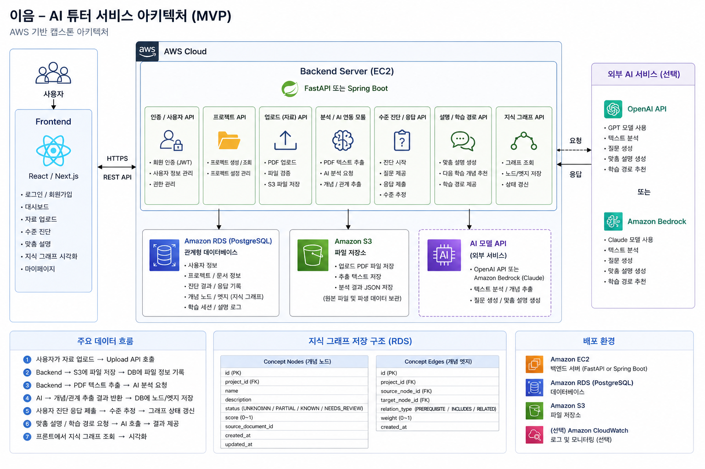
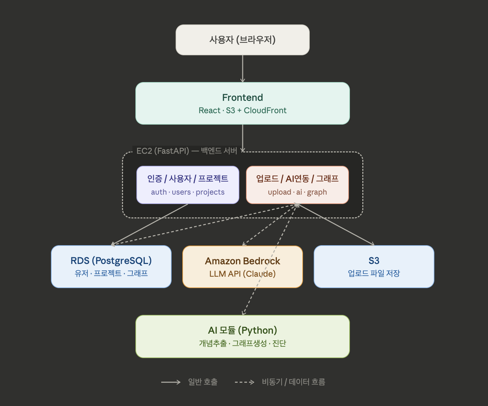

<style>
  :root {
    --eeum-bg: #f7f8fb;
    --eeum-panel: #ffffff;
    --eeum-text: #182033;
    --eeum-muted: #657084;
    --eeum-line: #dde3ee;
    --eeum-primary: #5b5bd6;
    --eeum-primary-dark: #32328f;
    --eeum-accent: #18a999;
    --eeum-warm: #f59e0b;
    --eeum-shadow: 0 18px 44px rgba(24, 32, 51, 0.1);
  }

  .page-header {
    display: none;
  }

  #header_wrap {
    display: none;
  }

  body {
    background: var(--eeum-bg);
  }

  .main-content,
  #main_content.inner {
    max-width: 1180px;
    padding: 32px 24px 72px;
  }

  .eeum-hero {
    display: grid;
    grid-template-columns: minmax(0, 1.25fr) minmax(280px, 0.75fr);
    gap: 28px;
    align-items: stretch;
    margin: 8px 0 36px;
    padding: 34px;
    color: #ffffff;
    background:
      radial-gradient(circle at 16% 12%, rgba(24, 169, 153, 0.42), transparent 28%),
      linear-gradient(135deg, #202646 0%, #353075 52%, #164d61 100%);
    border-radius: 18px;
    box-shadow: var(--eeum-shadow);
  }

  .eeum-brand {
    display: inline-flex;
    align-items: center;
    gap: 10px;
    margin-bottom: 26px;
    font-size: 15px;
    font-weight: 700;
    letter-spacing: 0;
  }

  .eeum-mark {
    width: 34px;
    height: 34px;
    border-radius: 10px;
    background: linear-gradient(135deg, var(--eeum-accent), #8b8cf0);
    box-shadow: inset 0 0 0 1px rgba(255, 255, 255, 0.35);
  }

  .eeum-kicker {
    margin: 0 0 8px;
    color: #b9f2ea;
    font-size: 14px;
    font-weight: 800;
    text-transform: uppercase;
  }

  .eeum-hero h1 {
    margin: 0;
    color: #ffffff;
    font-size: clamp(40px, 6vw, 70px);
    line-height: 1;
    letter-spacing: 0;
  }

  .eeum-hero-copy {
    max-width: 720px;
    margin: 22px 0 0;
    color: rgba(255, 255, 255, 0.86);
    font-size: 18px;
    line-height: 1.75;
  }

  .eeum-actions {
    display: flex;
    flex-wrap: wrap;
    gap: 12px;
    margin-top: 28px;
  }

  .eeum-actions a {
    display: inline-flex;
    align-items: center;
    min-height: 44px;
    padding: 0 18px;
    border-radius: 8px;
    font-weight: 800;
    text-decoration: none;
  }

  .eeum-actions a:first-child {
    color: #182033;
    background: #ffffff;
  }

  .eeum-actions a:last-child {
    color: #ffffff;
    border: 1px solid rgba(255, 255, 255, 0.38);
  }

  .eeum-summary {
    display: grid;
    gap: 12px;
    padding: 18px;
    border: 1px solid rgba(255, 255, 255, 0.2);
    border-radius: 14px;
    background: rgba(255, 255, 255, 0.1);
    backdrop-filter: blur(12px);
  }

  .eeum-summary strong {
    color: #ffffff;
    font-size: 18px;
  }

  .eeum-summary span {
    display: block;
    color: rgba(255, 255, 255, 0.72);
    font-size: 13px;
    font-weight: 700;
  }

  .eeum-summary a {
    display: block;
    padding: 14px 16px;
    color: #ffffff;
    border: 1px solid rgba(255, 255, 255, 0.18);
    border-radius: 10px;
    text-decoration: none;
    background: rgba(255, 255, 255, 0.09);
  }

  .eeum-section {
    margin: 42px 0;
  }

  .main-content h2 {
    margin-top: 42px;
  }

  .eeum-section h2 {
    margin-top: 0;
    color: var(--eeum-text);
    font-size: 30px;
    letter-spacing: 0;
  }

  .eeum-lead {
    color: var(--eeum-muted);
    font-size: 17px;
    line-height: 1.75;
  }

  .eeum-grid {
    display: grid;
    gap: 16px;
    margin-top: 18px;
  }

  .eeum-grid.two {
    grid-template-columns: repeat(2, minmax(0, 1fr));
  }

  .eeum-grid.three {
    grid-template-columns: repeat(3, minmax(0, 1fr));
  }

  .eeum-card {
    padding: 22px;
    color: var(--eeum-text);
    border: 1px solid var(--eeum-line);
    border-radius: 8px;
    background: var(--eeum-panel);
    box-shadow: 0 10px 26px rgba(24, 32, 51, 0.06);
  }

  .eeum-card strong {
    display: block;
    margin-bottom: 8px;
    color: var(--eeum-primary-dark);
    font-size: 17px;
  }

  .eeum-card p,
  .eeum-card li {
    color: var(--eeum-muted);
    line-height: 1.7;
  }

  .eeum-card ul {
    margin-bottom: 0;
    padding-left: 20px;
  }

  .eeum-stack {
    display: flex;
    flex-wrap: wrap;
    gap: 10px;
    margin-top: 16px;
  }

  .eeum-stack span {
    display: inline-flex;
    align-items: center;
    min-height: 34px;
    padding: 0 12px;
    color: #24304a;
    border: 1px solid #d7dded;
    border-radius: 8px;
    background: #ffffff;
    font-size: 14px;
    font-weight: 700;
  }

  .eeum-figure {
    margin: 18px 0 0;
    padding: 16px;
    border: 1px solid var(--eeum-line);
    border-radius: 8px;
    background: #ffffff;
  }

  .eeum-figure img {
    display: block;
    width: 100%;
    height: auto;
    border-radius: 6px;
  }

  .eeum-note {
    margin-top: 10px;
    color: var(--eeum-muted);
    font-size: 14px;
    text-align: center;
  }

  .eeum-callout {
    border-left: 5px solid var(--eeum-accent);
    background: #f0fbf9;
  }

  .eeum-footer {
    margin-top: 52px;
    padding-top: 18px;
    color: var(--eeum-muted);
    border-top: 1px solid var(--eeum-line);
    font-size: 14px;
  }

  @media (max-width: 860px) {
    .main-content,
    #main_content.inner {
      padding: 20px 16px 56px;
    }

    .eeum-hero,
    .eeum-grid.two,
    .eeum-grid.three {
      grid-template-columns: 1fr;
    }

    .eeum-hero {
      padding: 24px;
      border-radius: 12px;
    }

    .eeum-hero h1 {
      font-size: 44px;
    }
  }
</style>

<div class="eeum-hero" id="top">
  <div>
    <div class="eeum-brand">
      <span class="eeum-mark" aria-hidden="true"></span>
      <span>eeum | 이음</span>
    </div>
    <p class="eeum-kicker">Capstone Design 2026 Team 52</p>
    <h1>AI 기반 개인 맞춤 학습 튜터 서비스</h1>
    <p class="eeum-hero-copy">
      이음은 학습 자료, 이해도 진단, AI 설명, 지식 그래프를 연결하여 사용자가 자신의 학습 상태를 확인하고
      다음 학습 방향을 잡을 수 있도록 돕는 개인 맞춤 학습 서비스입니다.
    </p>
    <div class="eeum-actions">
      <a href="#project-intro">프로젝트 소개</a>
      <a href="#usage">실행 방법</a>
    </div>
  </div>
  <div class="eeum-summary" aria-label="프로젝트 요약">
    <strong>Page Contents</strong>
    <a href="#project-intro"><span>01</span>프로젝트 소개</a>
    <a href="#features"><span>02</span>주요 기능</a>
    <a href="#architecture"><span>03</span>시스템 구조</a>
    <a href="#tech-stack"><span>04</span>기술 스택</a>
  </div>
</div>

## 목차
{: .no_toc }

1. TOC
{:toc}

---

## 프로젝트 소개 {#project-intro}

이음은 흩어진 학습 자료와 질문, 피드백, 복습 기록을 하나의 흐름으로 연결하는 것을 목표로 합니다. 사용자는 프로젝트 단위로 학습 자료를 관리하고, AI가 현재 이해도를 진단한 뒤, 사용자 수준에 맞는 설명과 지식 그래프를 통해 다음 학습 경로를 확인할 수 있습니다.

<div class="eeum-grid three">
  <div class="eeum-card">
    <strong>문제 정의</strong>
    <p>학습자는 자료를 읽고 질문을 반복하지만, 개념 간 관계와 자신의 부족한 지점을 체계적으로 확인하기 어렵습니다.</p>
  </div>
  <div class="eeum-card">
    <strong>해결 방향</strong>
    <p>자료 분석, 수준 진단, AI 튜터링, 지식 그래프를 하나의 학습 프로젝트 안에서 연결합니다.</p>
  </div>
  <div class="eeum-card">
    <strong>기대 효과</strong>
    <p>사용자는 자신의 이해 수준에 맞는 설명을 받고, 누적된 지식 그래프를 통해 복습 경로를 확인할 수 있습니다.</p>
  </div>
</div>

---

## 주요 기능 {#features}

<div class="eeum-grid two">
  <div class="eeum-card">
    <strong>자료 업로드 및 분석</strong>
    <ul>
      <li>프로젝트 단위로 학습 자료를 업로드합니다.</li>
      <li>업로드된 자료의 분석 상태와 결과를 확인합니다.</li>
      <li>분석 결과를 진단과 AI 설명의 맥락으로 활용합니다.</li>
    </ul>
  </div>
  <div class="eeum-card">
    <strong>학습 수준 진단</strong>
    <ul>
      <li>최소 질문으로 사용자의 현재 이해도를 확인합니다.</li>
      <li>부족한 개념과 추천 학습 방향을 정리합니다.</li>
      <li>진단 결과를 이후 설명 난이도 조절에 활용합니다.</li>
    </ul>
  </div>
  <div class="eeum-card">
    <strong>맞춤 AI 튜터링</strong>
    <ul>
      <li>사용자 수준과 프로젝트 자료를 바탕으로 설명합니다.</li>
      <li>질문과 답변을 프로젝트별 채팅 기록으로 관리합니다.</li>
      <li>대화에서 새로 등장한 핵심 개념을 추출합니다.</li>
    </ul>
  </div>
  <div class="eeum-card">
    <strong>지식 그래프</strong>
    <ul>
      <li>학습한 개념과 개념 간 관계를 그래프로 시각화합니다.</li>
      <li>프로젝트별 그래프를 탐색하고 노드를 검색합니다.</li>
      <li>마이페이지에서 전체 학습 흐름으로 확장할 수 있습니다.</li>
    </ul>
  </div>
</div>

---

## 소개 영상 {#demo}

<div class="eeum-card eeum-callout">
  <strong>서비스 소개 영상 준비 중</strong>
  <p>최종 시연 영상 또는 배포 링크가 확정되면 이 영역에 YouTube, Google Drive, 배포 URL 등을 추가합니다.</p>
</div>

---

## 팀원 소개 {#team}

<div class="eeum-grid three">
  <div class="eeum-card">
    <strong>Frontend</strong>
    <p>랜딩, 대시보드, 자료 업로드, 진단, 마이페이지 UI와 사용자 흐름을 구현합니다.</p>
  </div>
  <div class="eeum-card">
    <strong>Backend / AI</strong>
    <p>API, 데이터 모델, 자료 분석, AI 응답, 진단 평가 흐름을 설계하고 구현합니다.</p>
  </div>
  <div class="eeum-card">
    <strong>Cloud / Infra</strong>
    <p>배포 환경, 스토리지, 데이터베이스, Lambda 분석 작업, 운영 보안을 담당합니다.</p>
  </div>
</div>

---

## 시스템 구조 {#architecture}

프론트엔드는 학습 프로젝트, 자료 업로드, 진단, 채팅, 지식 그래프 화면을 제공합니다. 백엔드는 인증과 데이터 저장, 파일 업로드 URL 발급, AI 호출을 조율하며, 업로드된 자료는 스토리지와 분석 파이프라인을 거쳐 요약, 개념, 관계 데이터로 변환됩니다.

<div class="eeum-figure">
  
  <p class="eeum-note">이음 서비스의 전체 시스템 흐름</p>
</div>

<div class="eeum-figure">
  
  <p class="eeum-note">자료 분석 및 AI 튜터링 처리 흐름</p>
</div>

---

## 기술 스택 {#tech-stack}

<div class="eeum-stack">
  <span>Next.js</span>
  <span>React</span>
  <span>TypeScript</span>
  <span>Tailwind CSS</span>
  <span>Zustand</span>
  <span>FastAPI</span>
  <span>Python</span>
  <span>AWS EC2</span>
  <span>AWS S3</span>
  <span>AWS Lambda</span>
  <span>Amazon Bedrock</span>
  <span>RDS PostgreSQL</span>
</div>

---

## 사용법 및 개발 환경 설정 {#usage}

<div class="eeum-grid two">
  <div class="eeum-card">
    <strong>프론트엔드 실행</strong>
    <pre><code>cd frontend
npm install
npm run dev</code></pre>
  </div>
  <div class="eeum-card">
    <strong>프로덕션 빌드 확인</strong>
    <pre><code>cd frontend
npm run build
npm run start</code></pre>
  </div>
  <div class="eeum-card">
    <strong>백엔드 API 환경 변수 예시</strong>
    <pre><code>NEXT_PUBLIC_USE_BACKEND_API=true
NEXT_PUBLIC_API_BASE_URL=/api/backend
BACKEND_API_URL=http://localhost:8000</code></pre>
  </div>
  <div class="eeum-card">
    <strong>백엔드 실행 예시</strong>
    <pre><code>cd backend
python -m venv .venv
source .venv/bin/activate
pip install -r requirements.txt
uvicorn app.main:app --reload --port 8000</code></pre>
  </div>
</div>

---

## 폴더 구조 {#folder-structure}

```text
2026-capstone-52/
├── docs/
│   ├── _config.yml              # GitHub Pages 설정
│   ├── index.md                 # 프로젝트 소개 페이지
│   ├── 이음_아키텍처.png
│   └── 이음_아키텍처2.png
├── README.md
└── .github/
```

소스 코드 저장소가 프론트엔드와 백엔드로 분리되어 있다면, 실제 제출 구조에 맞춰 이 섹션을 조정하면 됩니다.

---

## 참고 자료 {#references}

- 프로젝트 프론트엔드 README 및 TODO 문서
- Next.js, React, Tailwind CSS 공식 문서
- FastAPI 공식 문서
- AWS EC2, S3, Lambda, RDS, Amazon Bedrock 공식 문서

<p class="eeum-footer">
  Copyright &copy; 2026 Kookmin University Capstone Design Team 52.
</p>
